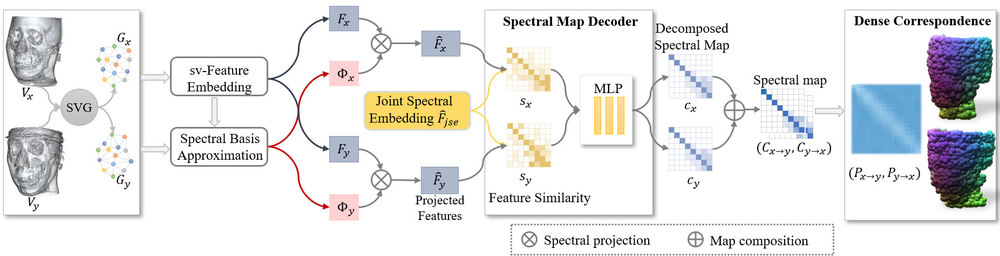

# Unified Spectral Learning (USL)
This repository contains the official implementation of the research paper - 
**"Bias-Alleviated Deep Spectral Map Learning for Dense Correspondence of Volumetric Medical Images"**



## Requirements and Installation
### System Requirements
- Python version: 3.7 or higher
- PyTorch version: 1.10.1 or higher
### Installation
To install the required Python packages, execute the following command:
```
pip install -r requirements.txt
```


## Data pre-processing
The volumetric images are pre-processed using MATLAB for supervoxel decomposition and probe supervoxel descriptors generation. Adjust the input and output paths in the MATLAB script to align with your dataset locations.
### Configuration
Modify the paths in `./MATLAB/data_preprocessing/preprocess_cbct.m` as follows:
```
file_dir = '/path/to/your/own/data';
output_dir = '/path/to/your/own/folder';
```
For both training and testing, each processed volumetric image generates a `.mat` file that is stored in the specified `output_dir`. 
It is recommended to adjust the number of supervoxels, compactness, and probe descriptor parameters according to the needs of your specific dataset.

## Synthetic Data Generation
Synthetic datasets are generated using random B-spline-based deformations to simulate variations. 
The paths for the input and output directories can be customized in the MATLAB script for synthetic data generation.
### Configuration
You could generate your own synthetic dataset by changing the input and output paths in `./MATLAB/synthetic_data_generation/datacreate_cbct.m`.
```
img_dir = '/path/to/training/img';
para_dir = '/path/to/training/para';
output_dir = '/path/to/your/own/folder';
```
It is also advisable to adjust deformation parameters to suit the characteristics of your dataset for optimal results.
## Data Organization
To ensure seamless integration and functionality with our provided dataloaders (`dataloader_cbct.py` and `dataloader_cbct_syn.py`), 
it is crucial to organize your dataset according to the following structure:
```
data/
└── CBCT/
    ├── train/
    │   ├── img/          # Contains original training images
    │   │   ├── 1his.mha  # Example image file
    │   │   ├── 2his.mha  # Example image file
    │   │   └── ...
    │   ├── para/         # Contains preprocessed information for training images
    │   │   ├── 1his.mat  # Preprocessed information for 1his.mha
    │   │   ├── 2his.mat  # Preprocessed information for 2his.mha
    │   │   └── ...
    │   ├── syn/          # Stores synthetic images generated for training
    │   │   ├── 1his/     # Synthetic data corresponding to 1his.mha
    │   │   │   ├── img/  # Synthetic images
    │   │   │   └── para/ # Parameters used for generating synthetic images
    │   │   ├── 2his/
    │   │   │   ├── img/
    │   │   │   └── para/
    │   │   └── ...
    │   └── synval/       # Synthetic validation data (structure similar to 'syn/')
    │       └── ...
    ├── valid/            # Contains validation data
    │   ├── img/          
    │   │   └── ...
    │   └── para/         
    │       └── ...
    └── test/             # Contains test data
        ├── img/
        │   └── ...
        └── para/
            └── ...
```
## Training
The training process is configured via a `YAML` file, and the training script can be run with specific configurations. 
Update the configuration file `./configs/default.yaml` to adjust the training parameters to your dataset. 
You can then initiate training with the following command:
```
python train_cbct.py --model_config_dir "./configs" --model_config_name "default.yaml" --model_save_dir "./checkpoints" --plot_dir "./temp_plots" --log_dir "./logs" --log_name "training_logs"
```
### Key Configuration Parameters (default.yaml)
- **MODEL**: Defines the architecture specifics.
- **DATASET**: Specifies paths for training and validation datasets, including images and preprocessed data.
- **ENGINE**: Controls training epochs, device settings, and logging details.
- **OPTIM**: Sets optimization parameters such as learning rate.
- **WEIGHTS**: Adjusts loss weights for different components of the loss function.

Please ensure all paths in the configuration are correctly set relative to your project directory.

### Pretrained Models
The parameters needed in training and testing can be downloaded from [model_downloads](https://drive.google.com/file/d/16jfzDOmoIALE_bMlAqvLnPQhTUi_WkZq/view?usp=drive_link), and should be placed in `./checkpoints`.

## Testing
For testing, configure `./configs/default_test.yaml` according to your requirements. 
Use the following command to execute the test script, which will evaluate the model and store results in the designated directory:
```
python test_cbct.py --model_config_dir "./configs" --model_config_name "default_test.yaml" --
```
### Key Configuration Parameters (default_test.yaml)
- **MODEL**: Specifies model parameters, including the path to the pretrained model.
- **DATASET**: Includes paths for the test volumes and their corresponding preprocessed data.
- **ENGINE**: Sets the device and directory for saving test results.

### Output
The output from testing will be stored as `.mat` files within the `./results` directory. 
These files contain the model predictions (the permutation matrix $P$) that can be further analyzed to assess performance.
